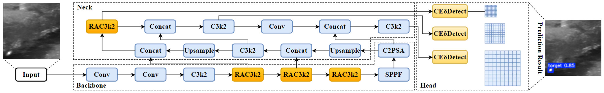
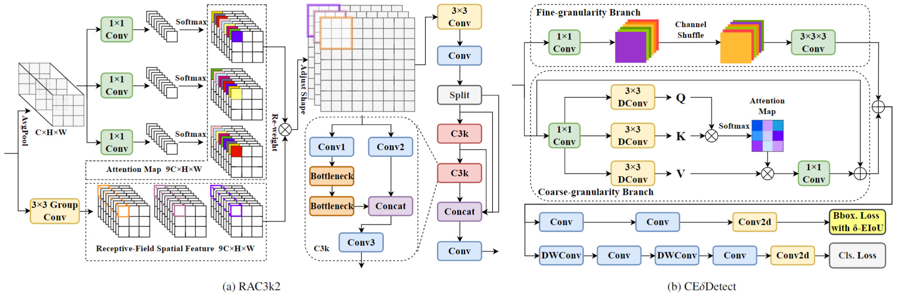
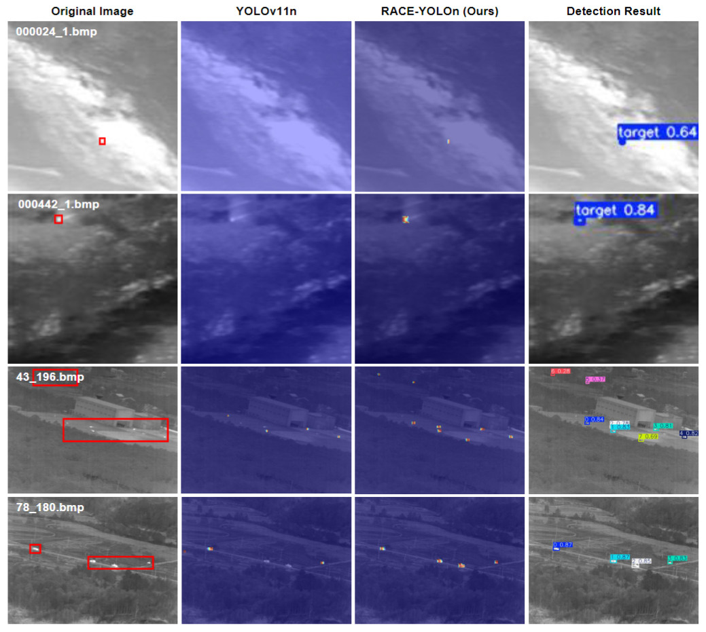

# RACE-YOLO: Recalibrated Attention and Cross-Granularity Enhanced YOLOv11 for Infrared Small Target Detection
**Authors:** Dongjie Zhou, Wenrui Li (Member, IEEE), Chang Liu, Yeyu Chai, Liang-Jian Deng (Senior Member, IEEE), Xiaopeng Fan (Senior Member, IEEE)

---

- [2026/05] A preliminary version of RACE-YOLO training and inference code has been released.

---

## Overview
This repository provides the official implementation of **RACE-YOLO**, a dynamically adaptive feature aggregation framework for infrared small target detection (IRSTD). RACE-YOLO integrates adaptive receptive-field recalibration with spatial expansion (via **RAC3k2**), cross-granularity channel shuffle with radiation-aware attention (via **CEδDetect**), and dynamic geometric penalty scaling (via **δ-EIoU** loss) to mitigate sub-pixel target fragmentation, feature dilution in deep networks, and bounding box regression instability.

<p align="center">
  
</p>

**Figure 1**: Overview of RACE-YOLO.

<p align="center">
  
</p>

**Figure 2**: Detail Structures of (a) RAC3k2 Module and (b) CEδDetect Module.

<p align="center">
  
</p>

**Figure 3**: Heatmap visualization comparisons on representative samples from the MDvsFA and ITSDT datasets demonstrate that RACE-YOLO achieves superior localization accuracy and exhibits enhanced sensitivity in target identification compared to YOLOv11.

---

## Environment Setup
```bash
# 1. Clone the repository
git clone https://github.com/tiger413/raceyolo.git
cd raceyolo

# 2. Create a virtual environment
conda create -n hymnet python=3.9

# 3. Activate the virtual environment
conda activate raceyolo

# 4. Install dependencies
pip install -r requirements.txt

# 5. Install the project in editable/development mode
pip install -e .
```

---

## Training

Run training:

```bash
python src/train.py
```
---

## Inference (Testing)

Run inference:

```bash
python src/test.py
```

------

## Acknowledgements

This project builds upon and is inspired by the following open-source projects and resources:

- Ultralytics: https://github.com/ultralytics/ultralytics
- LEGNet: https://github.com/AeroVILab-AHU/LEGNet
- FCM: https://github.com/galaxy-oss/FCM

We thank the authors for their excellent work.

------

## Contact

If you have any questions, please contact dongjiezhou@stu.hit.edu.cn
